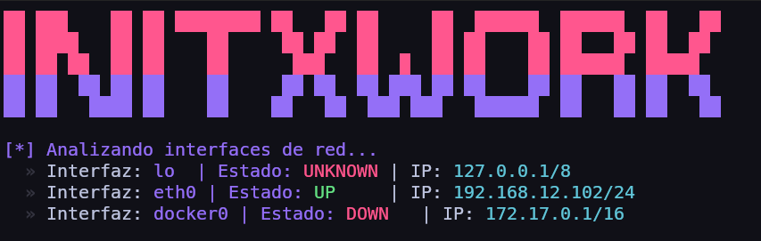
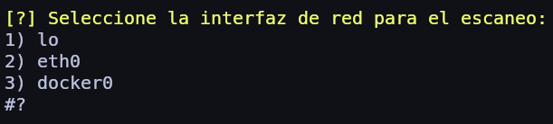
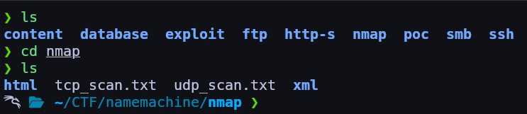
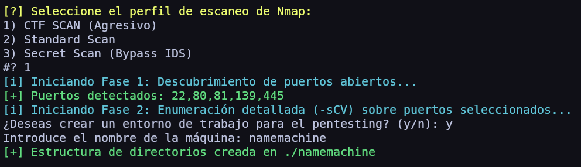

# InitXwork

Este es un proyecto que facilita la enumeración y análisis de hosts en entornos CTF o pruebas de penetración, utilizando `Nmap` para realizar escaneos de red. El script principal, `main.sh`, guía al usuario a través de la selección de objetivos, perfiles de escaneo y opciones avanzadas, generando resultados en formatos XML y HTML para una fácil interpretación.




## Características principales

- **Selección de Interfaces**: Permite al usuario seleccionar la interfaz de red que desea utilizar para el escaneo.
  

- **Creacion de WorkSpace**: Permite crear un directorio de trabajo personalozado e organizado con diferentes subdirectorios para faciliar el reconocimiento.
    

- **Resumen del los puertos**: Muestra un resumen de los puertos abiertos encontrados durante el escaneo.
  
  
  
## Instalación y uso

1. Clona el repositorio y navega al directorio del proyecto:
   ```bash
   git clone https://github.com/Tinn1o/InitXwork.git
   ```
2. Guarda el archivo en una carpeta seguro y navega a esa carpeta:
   ```bash
   cd InitXwork
   chmod +x *.sh
   ./main.sh
   ```
3. Modifica tu `.bashrc` o `.zshrc` para agregar el alias:
   ```bash
   alias initxwork='bash /ruta/a/InitXwork/main.sh'
   ```

4. Ahora puedes ejecutar el script desde cualquier lugar usando el alias:
   ```bash
   initxwork
   ```
